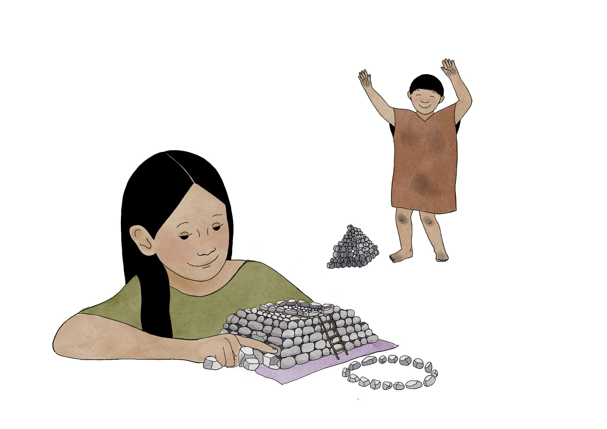

# **Capítulo 1: La Historia de Miraya y Lurihuasi**

## **Algoritmos, LEGOs y Caral**

Al pasear por Lima, es habitual encontrarse con lugares en los que parece que el tiempo se
detuvo: ruinas corroídas por el sol y por la lluvia tenue y gris que invade los inviernos. Estas
aparecen debajo de autopistas, rodeadas de casas, o arrumbadas en algún barrio. La ciudad
está infestada de ruinas, de historias interminables, y piedras que recuerdan otros tiempos.
A veces, estas construcciones perdidas reaparecen lejos de las grandes ciudades, en medio
del sol y el polvo, recordando esplendores antiguos. Caral, una ciudadela de algunos miles
de años de antigüedad ubicada al norte de Lima, es una de estas imágenes. Este imponente
centro ceremonial juega con historias de imaginarios prehispánicos que intentan flotar en el
desierto. Estudios arqueológicos afirman que Caral fue uno de los centros ceremoniales más
antiguos de todo Sudamérica.

Estas extrañezas que se cruzan en Caral -al menos para un extranjero- nos impulsa a
preguntarnos: ¿en qué medida los paisajes arqueológicos pueden entremezclarse con
nociones sobre algoritmos? Aquí es necesario que nos detengamos un momento. Los
algoritmos nos rodean. Sin siquiera darnos cuenta, el algoritmo de Spotify nos hace escuchar
a Taylor Swift, mientras descubrimos que necesitamos un nuevo sofá. Una idea maravillosa
que surgió desde ideas dispersas entre Ada Lovelace, Alan Turing y un sinfín de famosos, es
que las computadoras son ni más ni menos que máquinas capaces de procesar algoritmos.
Aparece otra pregunta, más específica y más radical: ¿será posible entremezclar las ideas
sobre algoritmos y computadoras con historias, ensoñaciones e imaginarios arqueológicos
en la formación algorítmica de estudiantes de humanidades?

Esta pregunta, que en una primera mirada parece un poco extraña, encierra un aspecto
fundamental de la formación en programación: en general, este conocimiento está
integrado generalmente con cursos de física o matemáticas. Los imaginarios en estas
perspectivas que vienen de la ingeniería o las ciencias exactas aparecen en fascinaciones por
robots, máquinas que aprenden un lenguaje o que pueden crear imágenes de un gato. ¿Qué
ocurre si las fascinaciones rebasan la tecnología, y abarcan, por ejemplo, preguntas
literarias, reflexiones filosóficas, cuestiones sobre palabras o incluso sobre arqueología?
¿Cómo se reconstruyen los imaginarios de jóvenes que comienzan en las humanidades, que
en principio no se interesan por robots (aunque sería interesante que ocurriera)? ¿Será
posible crear historias algorítmicas o experimentos algorítmicos basados en historias? 

A partir de ideas y ensoñaciones arqueológicas, los participantes de esta historia construyen
con piezas de LEGO una maqueta de Caral, que busca resonar en sus ideas preconcebidas y
sus propios recuerdos. Cada pieza de LEGO es una piedra de otro tiempo: sin hacer
distinciones entre tecnologías antiguas o modernas, las materialidades cambian, pero las
construcciones, las reglas e instrucciones se mantienen. En un futuro de máquinas e
inteligencias artificiales, esas figuras de LEGO serán descubiertas por arqueologías que
tratarán de leer capas de significado, un tejido de versiones unidas por los algoritmos.

---

## **Miraya y Lurihuasi, los niños constructores de Caral**

La historia comienza con Miraya y Lurihuasi, unos niños de Caral, que sin querer, programan
con piedras, barro, y amor por las construcciones y las pirámides. Tal como los participantes
actuales, Miraya y Lurihuasi juegan a armar figuras a partir de elementos simples, y también
a tejer instrucciones de cómo construir figuras. Parece que las instrucciones formadas de
reglas simples, casi insignificantes, que ahora llamamos algoritmos, son algo anterior a su
creación: como decía Borges, que cada escritor crea sus precursores; aquí cada algoritmo
crea sus precursores, que pueden reflejarse, quizás tenuemente, en Caral.

**Ilustración de Miraya y Lurihuasi**

Hace algunos miles de años, en las afueras de Caral, Miraya, una niña de 10 años, jugaba
todos los días con su hermano menor Lurihuasi.

A pesar de la muchedumbre, los mercados, la gente de otros lugares lejanos, a veces con
lenguas extrañas, ellos recorrían cada rincón de Caral. Miraya estaba fascinada con las
puestas de sol, en donde las pirámides parecían haber sido hechas por seres sobrenaturales.
Ella sabía, sin embargo, que las pirámides eran construidas por los adultos a partir de una
mezcla de piedras, barro y pintura. 

Un día, mirando el atardecer, Miraya le preguntó a
Lurihuasi:

- **¿Sabes cómo construir una pirámide?**  
- **No, pero podríamos intentarlo**, respondió Lurihuasi.  
- **¡Podríamos!**, Le respondió Miraya, mientras se imaginaba a sí misma en el futuro.

La imaginación de un futuro de felicidad infinita, y también, en parte, las palabras de su
hermano, la hizo pensar que su admiración por la construcción tenía que transformarse en
acción. Desde ese momento, supo que tenía que dedicarse a aprender cómo unir las piezas,
un poco pesadas para su corta edad, pero livianas al lado de su impetuoso entusiasmo. De
los adultos había escuchado que habían dos maneras de construir. El primero era seguir las
instrucciones que estaban plasmadas en unos quipus enormes, que los adultos guardaban
secretamente. El segundo, que era el preferido de Miraya, era partir de la observación de
alguna pirámide, y después anudar en los quipus -técnica en parte perdida en el tiempo,
pero que ha sobrevivido al paso de los siglos- instrucciones de cómo mover piedras, usar el
barro y pintar de colores maravillosos.

**Ilustración de Quipus**

Miraya ideó un plan. Al atardecer, cuando sus padres descansaban después de un largo día
de trabajo, robaron algunas piedras pequeñas -bueno, las tomaron prestadas-, un poco de
barro y pintura.

- **¿Qué quieres hacer con eso?** - Balbuceó con voz asustada Lurihuasi, pensando en el
castigo de sus padres.
- **No digas nada, será nuestro secreto.**

En silencio, se repartieron 15 piedras pequeñas cada uno, de diferentes tamaños y formas.
Miraya miró desafiante a su hermano y le dijo:

- **Te reto a construir una figura con piedras y barro que sea parecida a la pirámide que
vemos por donde el sol se esconde.**

**Ilustración de hermanos**

Su hermano, con cara de incrédulo, se tomó la cabeza y no sabía cómo empezar.

- **El sol está a punto de esconderse** - Le dijo.
- **No hay problema, ya hemos visto la pirámide muchas veces.**

Y a la luz de unas antorchas, y usando la memoria de las innumerables puestas de sol,
emprendieron la tarea de armar una figura cada uno. El reto parecía sencillo, pero mover las
piedras, usar el barro y no quedar sucios -y arriesgar un castigo de sus padres- se volvió casi
imposible. Al cabo de unos minutos, que parecían eternos, habían dos figuras, que tenían
algo de Caral, pero que al mismo tiempo capturaban su propia creatividad.

- **Mi figura es más bonita que la tuya!** - Mientras Lurihuasi bailaba de felicidad
alrededor de su hermana.
- **La mía se parece a la figura que voy a construir cuando sea grande** - Reflexionó
orgullosa de su obra maestra.

**Ilustración de las versiones de Caral**

De pronto, escucharon unos ruidos. Era su mamá que los llamaba:

- **Miraya! Lurisuahi! ¿Dónde están?** - Gritaba con tono preocupado.
- **Acá estamos!** - Respondió Miraya, y su mamá aún un poco dormida volvió a
acostarse.

Para evitar un castigo, se propusieron hacer quipus con las instrucciones de cómo
reconstruir las figuras. Así, al día siguiente seguiría el juego, pero ahora tendrían que
desenredar de esa maravillosa forma de guardar información sus versiones de Caral. Antes
de acostarse desarmaron -y destruyeron- Caral, en un acto que Miraya sintió como el inicio
de una nueva era: Miraya ahora era constructora, y un poco, solo un poco, destructora.

Al amanecer, Miraya se despertó con la emoción de sentirse constructora. Ahora, podía decirle a sus amigos que cuando sea grande ella construiría pirámides más altas que el sol. Nadie la haría cambiar de opinión. Su hermano, como todos los días, no quería levantarse, aunque un pequeño golpe lo hizo recordar el plan. Ya era hora de desentramar quipus.

- **¡Despierta Lurihuasi!** - Lanzándole una pequeña piedra.
- **Debemos intercambiar los quipus** - Le dijo saltando de su cama, con una idea que sorprendió a Miraya.
- **¡Acepto el reto!**

Al mirar el quipu que había hecho Lurihuasi pensó frunciendo el ceño “¡No entiendo nada!”, con nudos mal hechos y colores mal puestos; a diferencia del suyo, que seguía las reglas que había aprendido de su mamá, que a su vez lo había heredado de su abuela. A pesar de todo, al pasar el rato, y mucho esfuerzo, empezó a revelarse una imagen de Caral, un poco simplificada, un poco extraña, que tenía un parecido con los dibujos de pirámides que dejaba por todos lados; incluso paredes, que quedaban como vestigios de su propia imaginación.

- **¡Ya entendí tus nudos!** - Le dijo aliviada a Lurihuasi.
- **Yo ya terminé mi versión de Caral** - Le respondió, con cara de triunfo.

Miraya juntó piezas, usó un poco de barro, probó combinaciones, hasta que luego de un momento sintió un estallido de felicidad: ya era una constructora que leía instrucciones desde un quipu.

- **A pesar de tu desastre, ya tengo mi Caral** - Lo miró desafiante.

Ambos estaban felices. Cada versión era diferente, pero al mismo tiempo se reconocían formas y estructuras, que resonaban en la historia de su pueblo, y su propia familia.

- **¡Eso no se parece a lo que hice ayer!** - Mientras se reía de su hermana y apuntaba a su maqueta.
- **¡Tú no sabes escribir en quipus!** - Gritó Miraya a su hermano, recordando las veces que se escondía de las lecciones que les daba su mamá.
Las versiones pequeñas de Caral quedaron en el lugar donde les gustaba mirar el horizonte.

Al atardecer pudieron comparar sus creaciones con la realidad, que comenzó a mezclarse con sus ideas de un futuro de constructores, y el imaginario infinito de piezas que se unen con barro, pero que perduran por los siglos.
---

