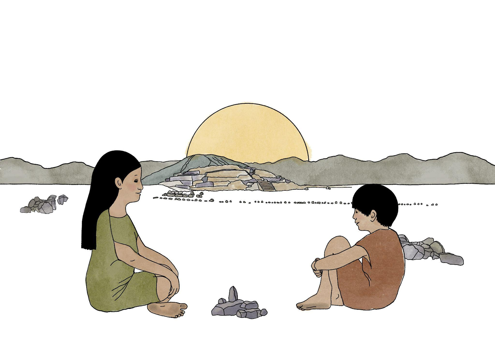
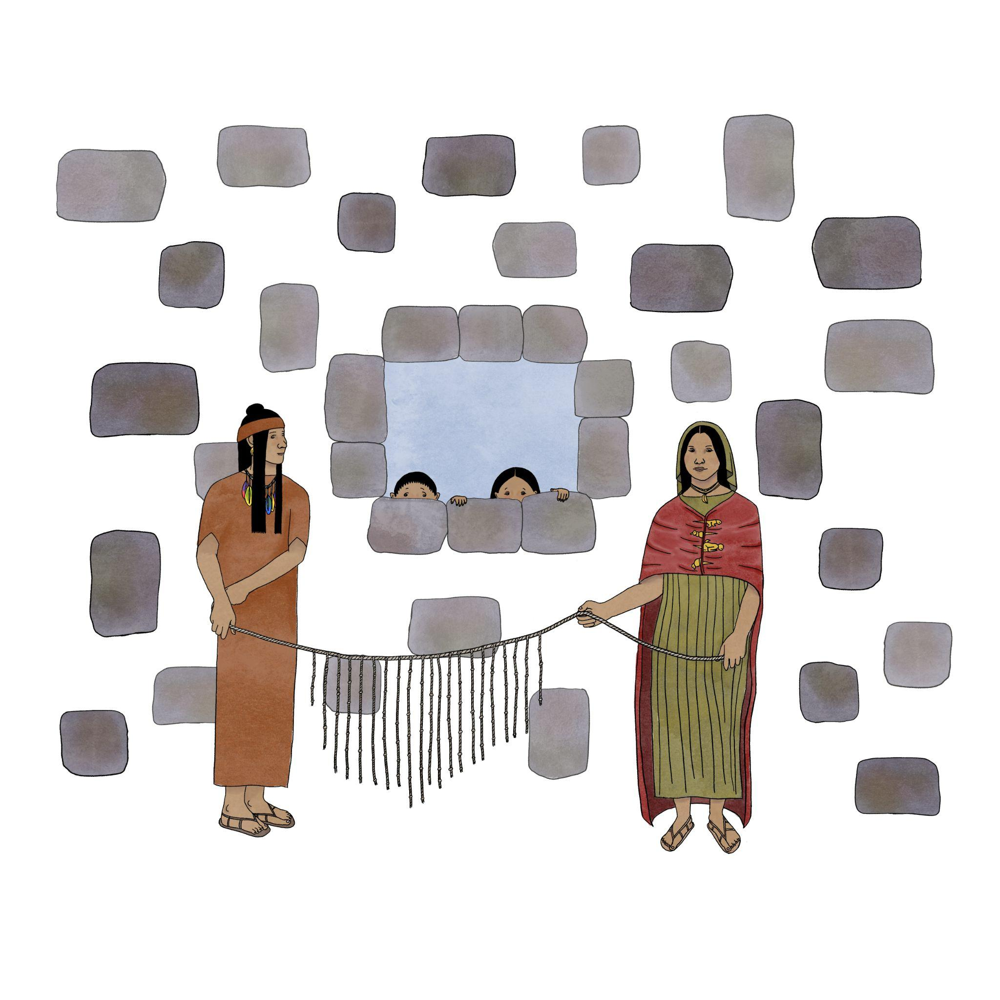
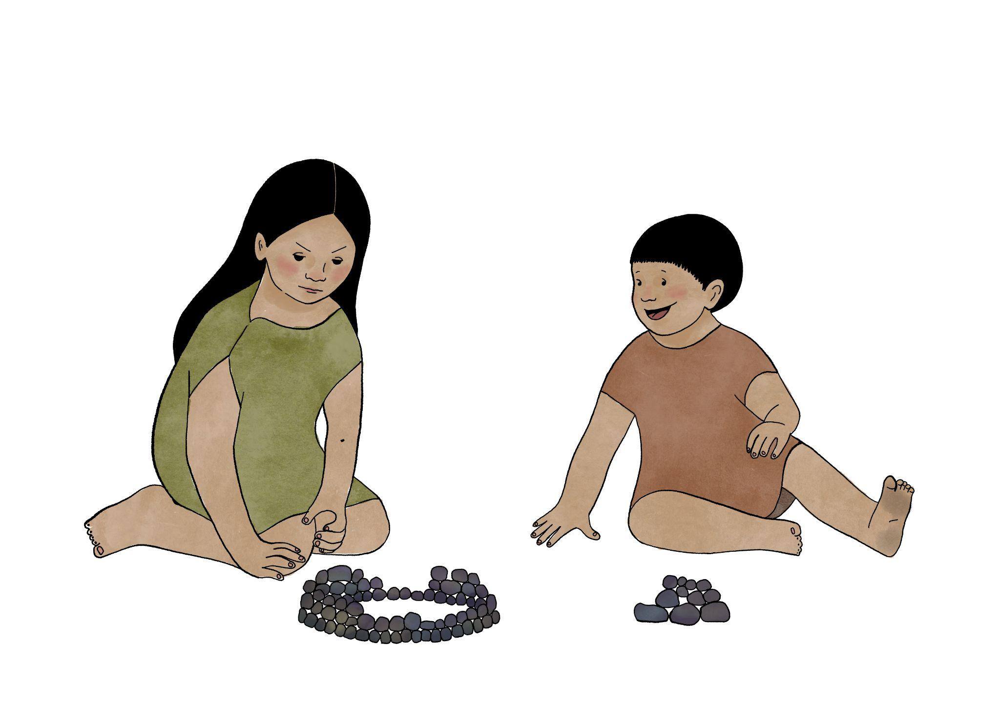

# **Capítulo 1: La Historia de Miraya y Lurihuasi**

## **Algoritmos, LEGOs y Caral**

Al pasear por Lima, es habitual encontrarse con lugares en los que parece que el tiempo se
detuvo: ruinas corroídas por el sol y por la lluvia tenue y gris que invade los inviernos. Estas
aparecen debajo de autopistas, rodeadas de casas, o arrumbadas en algún barrio. La ciudad
está infestada de ruinas, de historias interminables, y piedras que recuerdan otros tiempos.
A veces, estas construcciones perdidas reaparecen lejos de las grandes ciudades, en medio
del sol y el polvo, recordando esplendores antiguos. Caral, una ciudadela de algunos miles
de años de antigüedad ubicada al norte de Lima, es una de estas imágenes. Este imponente
centro ceremonial juega con historias de imaginarios prehispánicos que intentan flotar en el
desierto. Estudios arqueológicos afirman que Caral fue uno de los centros ceremoniales más
antiguos de todo Sudamérica.

**Imagen de Caral**

Estas extrañezas que se cruzan en Caral -al menos para un extranjero- nos impulsa a
preguntarnos: ¿en qué medida los paisajes arqueológicos pueden entremezclarse con
nociones sobre algoritmos? Aquí es necesario que nos detengamos un momento. Los
algoritmos nos rodean. Sin siquiera darnos cuenta, el algoritmo de Spotify nos hace escuchar
a Taylor Swift, mientras descubrimos que necesitamos un nuevo sofá. Una idea maravillosa
que surgió desde ideas dispersas entre Ada Lovelace, Alan Turing y un sinfín de famosos, es
que las computadoras son ni más ni menos que máquinas capaces de procesar algoritmos.
Aparece otra pregunta, más específica y más radical: ¿será posible entremezclar las ideas
sobre algoritmos y computadoras con historias, ensoñaciones e imaginarios arqueológicos
en la formación algorítmica de estudiantes de humanidades?

Esta pregunta, que en una primera mirada parece un poco extraña, encierra un aspecto
fundamental de la formación en programación: en general, este conocimiento está
integrado generalmente con cursos de física o matemáticas. Los imaginarios en estas
perspectivas que vienen de la ingeniería o las ciencias exactas aparecen en fascinaciones por
robots, máquinas que aprenden un lenguaje o que pueden crear imágenes de un gato. ¿Qué
ocurre si las fascinaciones rebasan la tecnología, y abarcan, por ejemplo, preguntas
literarias, reflexiones filosóficas, cuestiones sobre palabras o incluso sobre arqueología?
¿Cómo se reconstruyen los imaginarios de jóvenes que comienzan en las humanidades, que
en principio no se interesan por robots (aunque sería interesante que ocurriera)? ¿Será
posible crear historias algorítmicas o experimentos algorítmicos basados en historias? 

A partir de ideas y ensoñaciones arqueológicas, los participantes de esta historia construyen
con piezas de LEGO una maqueta de Caral, que busca resonar en sus ideas preconcebidas y
sus propios recuerdos. Cada pieza de LEGO es una piedra de otro tiempo: sin hacer
distinciones entre tecnologías antiguas o modernas, las materialidades cambian, pero las
construcciones, las reglas e instrucciones se mantienen. En un futuro de máquinas e
inteligencias artificiales, esas figuras de LEGO serán descubiertas por arqueologías que
tratarán de leer capas de significado, un tejido de versiones unidas por los algoritmos.

La historia comienza con Miraya y Lurihuasi, unos niños de Caral, que sin querer, programan
con piedras, barro, y amor por las construcciones y las pirámides. Tal como los participantes
actuales, Miraya y Lurihuasi juegan a armar figuras a partir de elementos simples, y también
a tejer instrucciones de cómo construir figuras. Parece que las instrucciones formadas de
reglas simples, casi insignificantes, que ahora llamamos algoritmos, son algo anterior a su
creación: como decía Borges, que cada escritor crea sus precursores; aquí cada algoritmo
crea sus precursores, que pueden reflejarse, quizás tenuemente, en Caral.

---

## **Miraya y Lurihuasi, los niños constructores de Caral**

La historia comienza con **Miraya y Lurihuasi**, unos niños de Caral, que sin querer, programan con piedras, barro y amor por las construcciones y las pirámides. Tal como los participantes actuales, Miraya y Lurihuasi juegan a armar figuras a partir de elementos simples, y también a **tejer instrucciones de cómo construir figuras**.

**Ilustración de Miraya y Lurihuasi**

Hace algunos miles de años, en las afueras de Caral, **Miraya, una niña de 10 años**, jugaba todos los días con su hermano menor **Lurihuasi**.

A pesar de la muchedumbre, los mercados y la gente de otros lugares lejanos, ellos recorrían cada rincón de Caral. Miraya estaba fascinada con las puestas de sol, en donde las pirámides parecían haber sido hechas por **seres sobrenaturales**. Sin embargo, sabía que estas estructuras eran construidas por los adultos **a partir de una mezcla de piedras, barro y pintura**.

Un día, mirando el atardecer, Miraya le preguntó a su hermano:

- **¿Sabes cómo construir una pirámide?**  
- **No, pero podríamos intentarlo**, respondió Lurihuasi.  
- **¡Podríamos!**, exclamó Miraya, mientras imaginaba su futuro.

Movidos por la emoción, Miraya y Lurihuasi tomaron algunas piedras pequeñas y un poco de barro y pintura. Pero pronto se enfrentaron a un problema: **¿cómo asegurarse de que su construcción pudiera replicarse con exactitud?** 

Miraya recordó que los adultos **guardaban instrucciones en quipus**. Así que decidió anudar en su propio quipu una serie de pasos detallados sobre **cómo mover piedras, usar barro y pintar de colores**.

**Ilustración de los Quipus**

Esa noche, utilizando la memoria de las innumerables puestas de sol que habían visto, comenzaron su construcción a la luz de antorchas. Tras mucho esfuerzo, cada uno logró una versión diferente de Caral.

- **¡Mi figura es más bonita que la tuya!**, exclamó Lurihuasi, bailando de felicidad.  
- **¡La mía se parece a la que construiré cuando sea grande!**, respondió Miraya con orgullo.

De repente, escucharon la voz de su madre llamándolos. **Debían desarmar sus figuras para no ser descubiertos**. Pero antes, decidieron crear **quipus con las instrucciones** para poder reconstruirlas al día siguiente.

Al amanecer, Miraya despertó sintiéndose **una constructora**, lista para enfrentar nuevos retos. Pero al intercambiar su quipu con el de Lurihuasi, se dio cuenta de algo:

- **¡No entiendo nada!**, se quejó al ver los nudos desordenados de su hermano.  
- **Yo ya terminé mi versión de Caral**, respondió él, con cara de triunfo.

**Ilustración de Miraya y Caral**

Pese a los errores iniciales, ambos lograron descifrar sus quipus y reconstruir Caral de manera diferente. Cada versión era única, pero reflejaba **una estructura común**, igual que los programas de computadora siguen una lógica compartida, aunque el código pueda variar.

Así, Miraya y Lurihuasi habían creado **los primeros algoritmos constructivos en Caral**, siglos antes de que alguien inventara la programación.

---

## **Reflexión Final**

La historia de **Miraya y Lurihuasi** nos muestra que la **creación de estructuras y la escritura de instrucciones** son procesos antiguos, que han acompañado a la humanidad durante milenios. De la misma manera en que los quipus permitían transmitir información en el tiempo, hoy en día los **algoritmos y la programación** nos permiten estructurar ideas y procesos de manera precisa.

**Conclusiones clave:**
✔ **El pensamiento algorítmico no es exclusivo de la computación.**  
✔ **Los algoritmos existen en las estructuras arquitectónicas y en la organización de información.**  
✔ **Los quipus de Caral y los programas de computadoras siguen la misma lógica de instrucciones secuenciales.**

Este capítulo nos prepara para entender cómo podemos aplicar estos conceptos en la actualidad, explorando nuevas formas de enseñanza del pensamiento computacional **sin necesidad de usar una computadora**.

**En el próximo capítulo, exploraremos el experimento LEGO-Caral y cómo podemos utilizar modelos físicos para desarrollar el pensamiento algorítmico en el aula.**

