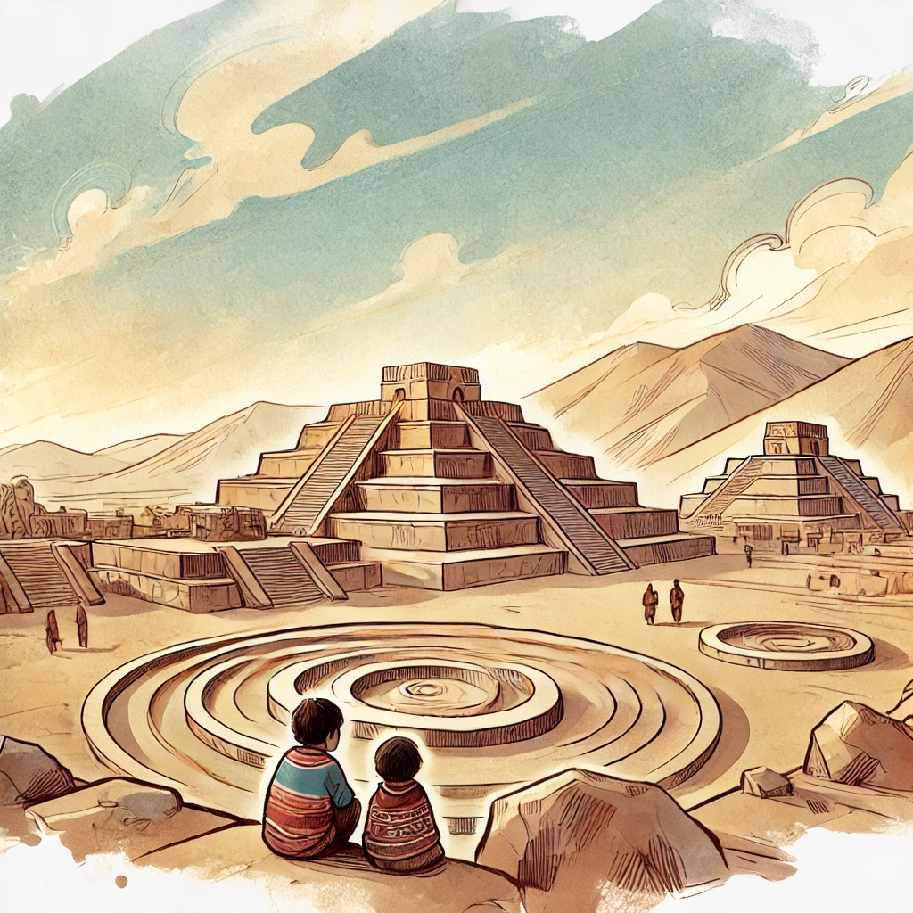

# **Capítulo 1: La Historia de Miraya y Lurihuasi**

## 📜 Algoritmos, LEGOs y Caral

Al pasear por Lima, es habitual encontrarse con lugares en los que parece que el tiempo se detuvo: ruinas corroídas por el sol y por la lluvia tenue y gris que invade los inviernos. Estas aparecen debajo de autopistas, rodeadas de casas, o arrumbadas en algún barrio. La ciudad está infestada de ruinas, de historias interminables y piedras que recuerdan otros tiempos.

A veces, estas construcciones perdidas reaparecen lejos de las grandes ciudades, en medio del sol y el polvo, recordando esplendores antiguos. **Caral**, una ciudadela de algunos miles de años de antigüedad ubicada al norte de Lima, es una de estas imágenes. Este imponente centro ceremonial juega con historias de imaginarios prehispánicos que intentan flotar en el desierto. Estudios arqueológicos afirman que Caral fue uno de los centros ceremoniales más antiguos de todo Sudamérica.

📌 **Imagen de Caral**

Estas extrañezas que se cruzan en Caral nos impulsan a preguntarnos: **¿en qué medida los paisajes arqueológicos pueden entremezclarse con nociones sobre algoritmos?** Aquí es necesario detenernos un momento. Los algoritmos nos rodean. Sin siquiera darnos cuenta, el algoritmo de Spotify nos hace escuchar a Taylor Swift, mientras descubrimos que necesitamos un nuevo sofá. Una idea maravillosa que surgió desde ideas dispersas entre **Ada Lovelace, Alan Turing y otros grandes pensadores** es que las computadoras son **máquinas capaces de procesar algoritmos**.

Aparece otra pregunta, más específica y más radical: **¿será posible entremezclar las ideas sobre algoritmos y computadoras con historias, ensoñaciones e imaginarios arqueológicos en la formación algorítmica de estudiantes de humanidades?** 

A partir de estas preguntas, nace un experimento donde los participantes construyen con piezas de LEGO una maqueta de **Caral**, resonando con ideas preconcebidas y recuerdos. Cada pieza de LEGO es una piedra de otro tiempo: sin hacer distinciones entre tecnologías antiguas o modernas, las materialidades cambian, pero las construcciones, las reglas e instrucciones se mantienen.

---

## **🏛 La Historia de Miraya y Lurihuasi**

La historia comienza con **Miraya y Lurihuasi**, unos niños de Caral, que sin querer, programan con piedras, barro y amor por las construcciones y las pirámides. Tal como los participantes actuales, Miraya y Lurihuasi juegan a armar figuras a partir de elementos simples, y también a **tejer instrucciones de cómo construir figuras**.

📌 **Ilustración de Miraya y Lurihuasi**

Hace algunos miles de años, en las afueras de Caral, **Miraya, una niña de 10 años**, jugaba todos los días con su hermano menor **Lurihuasi**.

A pesar de la muchedumbre, los mercados y la gente de otros lugares lejanos, ellos recorrían cada rincón de Caral. Miraya estaba fascinada con las puestas de sol, en donde las pirámides parecían haber sido hechas por **seres sobrenaturales**. Sin embargo, sabía que estas estructuras eran construidas por los adultos **a partir de una mezcla de piedras, barro y pintura**.

Un día, mirando el atardecer, Miraya le preguntó a su hermano:

- **¿Sabes cómo construir una pirámide?**  
- **No, pero podríamos intentarlo**, respondió Lurihuasi.  
- **¡Podríamos!**, exclamó Miraya, mientras imaginaba su futuro.

Movidos por la emoción, Miraya y Lurihuasi tomaron algunas piedras pequeñas y un poco de barro y pintura. Pero pronto se enfrentaron a un problema: **¿cómo asegurarse de que su construcción pudiera replicarse con exactitud?** 

Miraya recordó que los adultos **guardaban instrucciones en quipus**. Así que decidió anudar en su propio quipu una serie de pasos detallados sobre **cómo mover piedras, usar barro y pintar de colores**.

📌 **Ilustración de los Quipus**

Esa noche, utilizando la memoria de las innumerables puestas de sol que habían visto, comenzaron su construcción a la luz de antorchas. Tras mucho esfuerzo, cada uno logró una versión diferente de Caral.

- **¡Mi figura es más bonita que la tuya!**, exclamó Lurihuasi, bailando de felicidad.  
- **¡La mía se parece a la que construiré cuando sea grande!**, respondió Miraya con orgullo.

De repente, escucharon la voz de su madre llamándolos. **Debían desarmar sus figuras para no ser descubiertos**. Pero antes, decidieron crear **quipus con las instrucciones** para poder reconstruirlas al día siguiente.

Al amanecer, Miraya despertó sintiéndose **una constructora**, lista para enfrentar nuevos retos. Pero al intercambiar su quipu con el de Lurihuasi, se dio cuenta de algo:

- **¡No entiendo nada!**, se quejó al ver los nudos desordenados de su hermano.  
- **Yo ya terminé mi versión de Caral**, respondió él, con cara de triunfo.

📌 **Ilustración de Miraya y su quipu**

Pese a los errores iniciales, ambos lograron descifrar sus quipus y reconstruir Caral de manera diferente. Cada versión era única, pero reflejaba **una estructura común**, igual que los programas de computadora siguen una lógica compartida, aunque el código pueda variar.

Así, Miraya y Lurihuasi habían creado **los primeros algoritmos constructivos en Caral**, siglos antes de que alguien inventara la programación.

---

## 🔍 **Reflexión Final**

La historia de **Miraya y Lurihuasi** nos muestra que la **creación de estructuras y la escritura de instrucciones** son procesos antiguos, que han acompañado a la humanidad durante milenios. De la misma manera en que los quipus permitían transmitir información en el tiempo, hoy en día los **algoritmos y la programación** nos permiten estructurar ideas y procesos de manera precisa.

📌 **Conclusiones clave:**
✔ **El pensamiento algorítmico no es exclusivo de la computación.**  
✔ **Los algoritmos existen en las estructuras arquitectónicas y en la organización de información.**  
✔ **Los quipus de Caral y los programas de computadoras siguen la misma lógica de instrucciones secuenciales.**

Este capítulo nos prepara para entender cómo podemos aplicar estos conceptos en la actualidad, explorando nuevas formas de enseñanza del pensamiento computacional **sin necesidad de usar una computadora**.

🚀 **En el próximo capítulo, exploraremos el experimento LEGO-Caral y cómo podemos utilizar modelos físicos para desarrollar el pensamiento algorítmico en el aula.**

